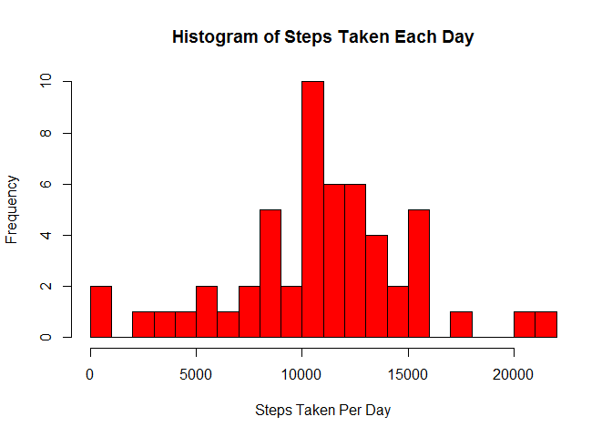
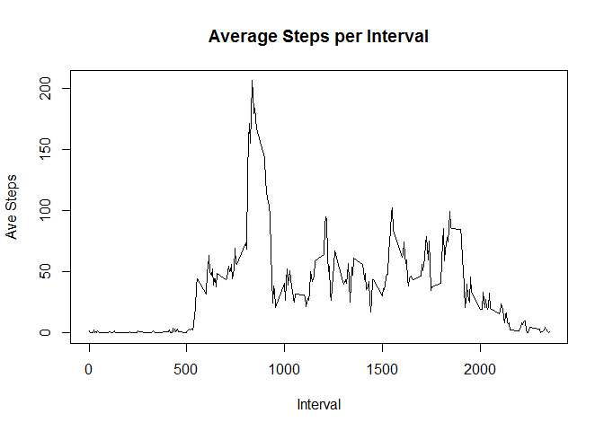
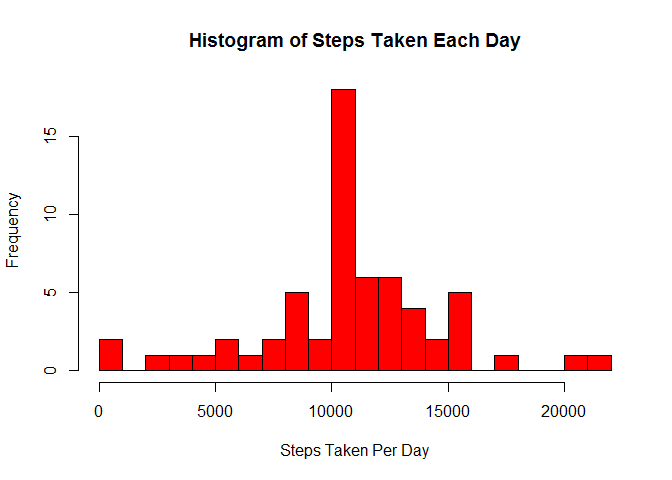

# Reproducible Research: Peer Assessment 1

This is the report for the Reproducable Research Assignment 1. 

## Loading and preprocessing the data

The first step is to load and review the data as follows:


```r
setwd("~/RFolder/RepData_PeerAssessment1")

dataset <- read.csv("./activity.csv")

summary(dataset)
```

```
##      steps                date          interval     
##  Min.   :  0.00   2012-10-01:  288   Min.   :   0.0  
##  1st Qu.:  0.00   2012-10-02:  288   1st Qu.: 588.8  
##  Median :  0.00   2012-10-03:  288   Median :1177.5  
##  Mean   : 37.38   2012-10-04:  288   Mean   :1177.5  
##  3rd Qu.: 12.00   2012-10-05:  288   3rd Qu.:1766.2  
##  Max.   :806.00   2012-10-06:  288   Max.   :2355.0  
##  NA's   :2304     (Other)   :15840
```

Then load the packages that will be needed for this assignment:


```r
library(dplyr)
```

```
## 
## Attaching package: 'dplyr'
## 
## The following objects are masked from 'package:stats':
## 
##     filter, lag
## 
## The following objects are masked from 'package:base':
## 
##     intersect, setdiff, setequal, union
```

```r
library(datasets)
library(lattice)
```

## What is mean total number of steps taken per day?

The first question to answer is: What is mean total number of steps taken per day?

Firstly, group the dataset by day and summarise by adding the steps in each group (which is each day):


```r
stepsperday <- dataset %>% group_by(date) %>% summarise(steps = sum(steps))
```

Then plot a histogram of the result.


```r
hist(stepsperday$steps, breaks = 20, xlab = "Steps Taken Per Day", main = "Histogram of Steps Taken Each Day", col = "red")
```

 

The next step is to calculate the mean and median steps per day as follows:


```r
meanstepsperday <- mean(stepsperday$steps, na.rm = TRUE)
medianstepsperday <- median(stepsperday$steps, na.rm = TRUE)
```

The mean steps per day is 10766 and the median steps per day is 10765.

## What is the average daily activity pattern?

The second question to answer is: What is the average daily activity pattern?

Firstly, group by the intervals and summarise by averaging the values within each group (interval).


```r
stepsperinterval <- dataset %>% group_by(interval) %>% summarise(steps = mean(steps, na.rm = TRUE))
```

Then plot the result.


```r
plot(stepsperinterval$interval, stepsperinterval$steps, type = "l", ylab = "Ave Steps", xlab = "Interval", main = "Average Steps per Interval")
```

 

Finally, find the interval with the highest average number of steps.


```r
maxsteps <- max(stepsperinterval$steps)
maxint <- as.integer(stepsperinterval[stepsperinterval$steps == max(stepsperinterval$steps), 1])
```

The interval with the highest average number of steps is interval number 835, which had an average of 206.1698113 steps.

## Imputing missing values

The next task is to replace the various NA missing values in the steps column of the dataset with a meaningful value. The strategy used here was, for each NA found in the steps column, replace it with the average steps value for the corresponding same interval. The stepsperinterval dataframe created in the previous question was used as a reference for the value to replace NA with.

The first step is to create a new dataset (called dataset2) which will have the NA missing values replaced. The assignment specifically asks for a new dataset to be created for this section. When dataset2 is created, count the number of missing values in the steps column.


```r
dataset2 <- dataset
missingvals <- sum(is.na(dataset2))
```
So the dataset2 has 2304 missing values.

Next, create a list of the row numbers in dataset2 that have missing values, then use that list in the sapply function to add the corresponding value (from stepsperinterval) into dataset2 to replace each missing value.


```r
list <- which( dataset2$steps %in% NA)

dataset2$steps[list] <- sapply(list, function(i){
        stepsperinterval$steps[stepsperinterval$interval %in% dataset2$interval[i]]
})
```

Similar to the first question, now group the dataset2 by day and summarise by adding the steps in each group (which is each day):


```r
stepsperday2 <- dataset2 %>% group_by(date) %>% summarise(steps = sum(steps))
```

Then plot a histogram of the resilt.


```r
hist(stepsperday2$steps, breaks = 20, xlab = "Steps Taken Per Day", main = "Histogram of Steps Taken Each Day", col = "red")
```

 

This is almost exactly the same as the histogram shown above which was plotted before the missing values were replaced, except that the bucket containing the mean steps value (10000 - 11000) has increased to 18. It appears most other Frequency values are the same.

Next, calculate the mean and median steps per day as follows:


```r
meanstepsperday2 <- mean(stepsperday2$steps)
medianstepsperday2 <- median(stepsperday2$steps)
```

When the missing values have been replaced with meaningful data, the new mean steps per day is 10766 and the new median steps per day is 10766.

## Are there differences in activity patterns between weekdays and weekends?

The final question to answer is if there is any difference in the activity patterns between weekdays and weekends. dataset2, with the replaced missing values, is to be used to answer this.

Firstly, turn the date column into a meaningful Date format:


```r
dataset2$date <- as.Date(dataset2$date, "%Y-%m-%d")
```

Next, add a new column to dataset2 indicating whether the date is a "weekday" or a "weekend" day. This is achieved by using the mutate function in the dplyr package, and the elseif function, if the day (for each row) is either "Saturday" or "Sunday", it is considered a weekend. Otherwise it must be a weekday. The weekdays function is used to get the day of the week for each date.


```r
dataset2 <- dataset2 %>% mutate(day = ifelse(weekdays(dataset2$date) %in% c("Saturday", "Sunday"), "weekend", "weekday"))
```

Next, group by the interval AND the day column, and get the mean number of steps for each grouping.


```r
stepsperinterval2 <- dataset2 %>% group_by(interval, day) %>% summarise(steps = mean(steps))
```

Finally, plot the result using a lattice plot showing the steps for each interval separated into weekday and weekend plots:


```r
xyplot(steps ~ interval | day, type = "l", data = stepsperinterval2, layout = c(1,2))
```

 

This plot shows that on weekends the average steps per interval is more evenly spread out across the daytime hours, approximately from 9am through to 8pm. On weekdays there is much more activity in the early hours from 5am to 9am, and in particular a burst from approximately 8am to 9am, before the activity reduces throughout the day. The activity does pick up again slightly in the late afternoon through to 8pm. One possible explanation for this is many people are doing exercise before their work, and most people work in the normal office hours of 9-5 on weekdays. On weekends people have more time to exercise at a time of the day that suits them. Furthermore, it appears the total activity over all intervals is higher on weekends, as most people have more leisure time to exercise.

